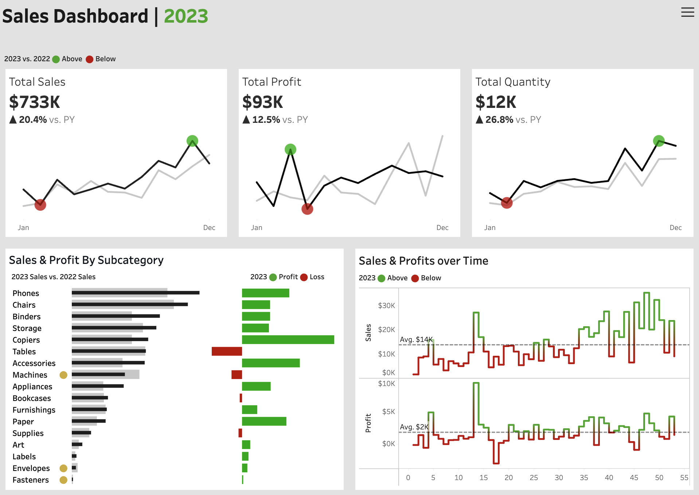

# Tableau Sales Dashboard

An interactive Tableau dashboard analyzing sales performance, profitability, and product trends to identify growth drivers and underperforming categories.

## Repository Structure

```
tableau-sales-dashboard/
├── data/
│   └── raw/              # Raw source data (CSV files)
├── tableau/
│   ├── Sales Dashboards.twbx   # Packaged Tableau workbook
│   └── screenshot.png          # Dashboard preview
├── README.md
└── EXECUTIVE_SUMMARY.md
```

## Project Overview

This project analyzes sales, profit, and quantity data across product categories and time to surface performance trends and inform inventory and pricing decisions.

## Key Objectives

- Track overall sales, profit, and quantity performance year-over-year
- Identify which subcategories drive revenue vs. which drive losses
- Visualize sales and profit trends over time to spot seasonality
- Deliver an interactive, filterable dashboard for ongoing monitoring

## Dashboard Preview



## Methodology

Raw sales data was loaded into Tableau and modeled to support KPI summary cards, a subcategory-level sales/profit comparison, and a time-series trend view. The dashboard compares current-year performance against the prior year across all views.

## Key Findings

See [EXECUTIVE_SUMMARY.md](EXECUTIVE_SUMMARY.md) for the full write-up.

- Total Sales reached $733K, up 20.4% year-over-year
- Total Profit reached $93K, up 12.5% year-over-year
- Total Quantity sold reached 12K units, up 26.8% year-over-year
- Profit growth is lagging sales growth, suggesting margin pressure worth investigating
- Several subcategories (including Tables) post negative profit despite generating sales, while categories like Phones and Copiers show strong profit contribution

## Tools Used

- Tableau (dashboard design and visualization)

## How to Open

1. Download `tableau/Sales Dashboards.twbx`
2. Open with Tableau Desktop or Tableau Public

